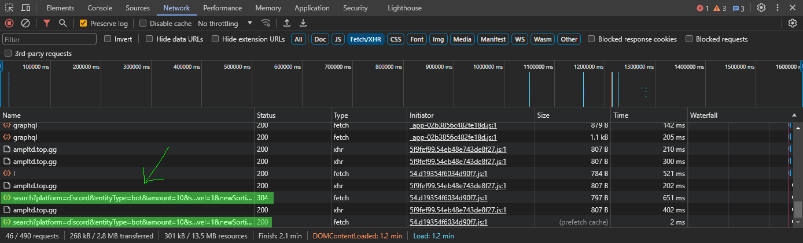
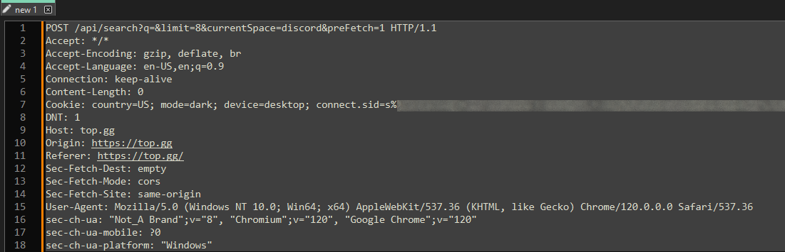

# top.gg discord bot site scraper
gets discord bot auth links from top.gg.
- demo:
> 

## setup
1. get the program
- clone this repo into a blank folder
- you can use git or the download feature on-site
2. setup your configuration
- open config.json and configure it how you want. if you don't know what to change, leave it default.
- see [config.json](#configjson)
3. get your cookie text from top.gg
- visit [top.gg/list/top](https://top.gg/list/top)
- pass the cloudflare check if you get one
- open developer tools
- go to the network tab
- on the page, scroll down until you see more bots loading
- on the network tab, look for these sort of requests:
- > 
- right click one of the requests, hover over copy, and click 'copy request headers' in the context menu
- paste the request headers into a blank file. they should look like this:
- > 
- remove all of the parts except for the content after the cookie area. it should look like this:
- ```country=US; mode=dark; device=desktop; connect.sid=XXXXXXXXXXXXXXXXXXX; theme=red; maintenanceBannerIsClosed=true; XXXXXXXXXXXXXXXXXXXXXXXXXXXXXXXXXX; XXXXXXXXXXXXXXXXXXXXXXXXXXXXXXXXXXXXXXX; cf_clearance=XXXXXXXXXXXXXXXXXXXXXXXXXXXXXXXXXXXXXXXXXXXXXXXXXX; __cf_bm=XXXXXXXXXXXXXXXXXXXXXXXXXXXXXXXXXXXXXXXXXXXXXXXXXXXXXXXXXXXXXXXXXXXXXXXX```
- ...with all of the Xs filled with data of course.
- paste the cookie text you have into "cookie.txt" in the same directory as config.json and main.js
4. run
- open a shell of your choice with nodejs installed to the working directory
- run `npm install` to install the dependancies
- run `node .` or `node main.js` to start the program!
- links are stored in output.txt

## config.json
this is where the configuration for the program goes. there aren't that many options, so it's simple to use.
`invitespersearchrequest` (*integer, default 10*) - how many bots to get before checking the ids of each. higher values typically make the program go faster, but there is a limit of 100. anything above that triggers a 500 error.
`clearpermissionsandscopes` (*boolean*) - clear permissions and scopes of vanilla discord auth links. good for inviting lots of bots to spoof member counts. changes permission values to 0, and scopes to only bot, making it so that the bot that joins is basically useless (lol). also prevents your discord email from being shared with bot developers.
`ignorenonvanillainvitelinks` (*boolean*) - if the invite link provided by a bot developer is anything other than a discord auth page (for example, arcane bot uses https://arcane.bot/invite), then don't save the link and skip it.

## notes
- thanks to the [blessed library](https://github.com/chjj/blessed) for making the console UI look epic
- this app intentionally doesn't use the top.gg api because I didn't know they had one. oops :P